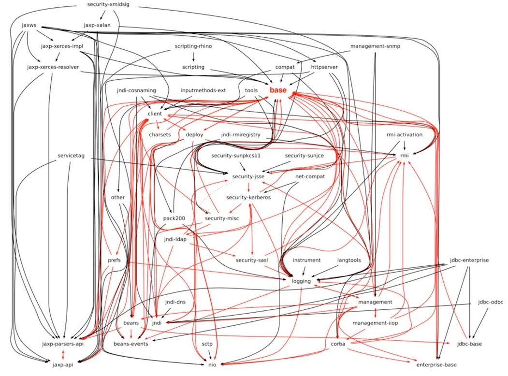

# Oneboot - 面向接口开发的企业应用解决方案

## 技术栈

- java JDK17+

## 项目结构说明

```log
- .sdk //SDK工具私有目录
- app //应用模块，包含启动类、业务代码
  - config //应用模块配置类
  - toolkit //应用模块工具类
- common //公共依赖模块
  - config //公共模块配置类，会被扫描
  - toolkit //各种公共工具类
- preset_sys //预置系统模块
  - **待定**
- sdk //开发工具模块，包含代码生成和其他各种功能
  - config
  - controller
  - gen
  - service
  - SdkApplication.java //SDK启动类，只在本地开发的时候使用
```

## 关于代码生成

### java rpc代码

1. 依赖了[Apache Thrift](https://thrift.apache.org/)框架。应用场景仅限于内网环境，服务端到服务端的通信（虽然性能明显优于http通信，但因为没有web权限那一套功能会造成很多麻烦，而且client线程安全性还有待验证。因此只应用于可信的服务端之间无高并发场景，可以认为是稳定可靠的。***此处期待benchmark***）
2. 由java通过命令行对thrift可执行文件的调用实现代码生成

### java restful接口部分

1. java端存储了thrift模板，和rpc部分一致，方便管理
2. 在[oneboot_rust](https://github.com/AlphaFoxz/oneboot_rust)项目中，依赖[pest](https://crates.io/crates/pest)库实现了一个针对thrift语法的解析器，输出[语法树](https://baike.baidu.com/item/%E8%AF%AD%E6%B3%95%E6%95%B0?fromtitle=%E8%AF%AD%E6%B3%95%E6%A0%91)
3. 然后通过rpc代码进行通信，将语法树（JSON）发送给java
4. java通过对语法树进行遍历，构建出对应的java bean
5. 通过java service对bean进行分析，生成指定代码

### ORM持久层部分

1. 整合了jOOQ和gradle-jooq-plugin
2. 通过执行gradle中的generateJooq任务，从数据库中反向建模到java

## Q&A

### 为什么是JDK17？

- Springboot3指定为17+，同时jdk17也是一个LTS版本，如果最新版本的虚拟线程足以改变格局，会考虑更新

### 既然采用了高版本JDK，为什么不用模块化构建本项目？

- 模块化是jdk9的新特性，其好处是显而易见的。然而受国情影响，在整合过程中或日后拓展时，一些jdk8的模块在集成时可能会遇到相当多的麻烦。故在设计时我会秉着谨慎的态度去依赖第三方库，并在未来时机成熟时改为模块化。（图为jdk8和jdk9内部依赖的对比）

### 为什么采用jOOQ作为

## TODO list

### 组件整合

- [X]  SpringSecurity - 安全模块
- [X]  SpringDoc - API文档
- [X]  Thrift - Rpc服务
- [X]  jOOQ - 持久层框架
- [ ]  Meilisearch - 搜索引擎（场景：面向中小型项目，索引上限2TiB）
- [ ]  工作流

### 代码生成

- [X]  rpc跨语言代码
- [X]  SpringDoc接口
- [X]  po、dao实体类
- [X]  typescript前端代码
- [X]  支持注解的生成
  - [ ]  支持注入HttpServletRequest
- [ ]  支持Restful Api中的路径传参。如：**GET** `/query/{type}/{id}`
- [ ]  MapStruct实体转换

### 其他特色功能

- [X]  项目功能检查（未实现的后端restful接口）
- [X]  接口一览
- [X]  独立的SDK客户端（Windows、Linux、Android）
- [X]  全平台统一枚举标准
- [ ]  名词定义机制？
- [ ]  用户可拓展的命令行终端
- [ ]  创建/恢复快照功能（备忘录设计模式？）
- [ ]  SQL分析

## [Apache2.0 LICESE](./LICENSE)
