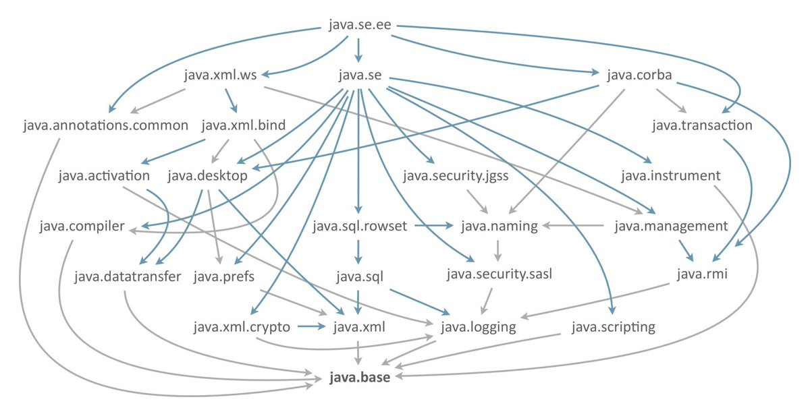

# Oneboot - 面向接口开发的企业应用解决方案

## 设计原则

WARNING：本项目是一个非常激进的项目。具体表现为：

### 基本理念

- 将“减少心智负担”为第一原则，将积极重构作为开发第一准则。
- 接受频繁的需求变更，拒绝根据数据表模块化。而是根据业务模块化，模块的内部在足够复杂时也推荐使用最佳设计模式。
- 框架不做数据库设计，过早的数据库设计意味着系统开始加速腐烂。事实上，我们只是在common模块设计了一系列标准，然后提供了一个预置`preset_sys`系统，如果你自己想实现的话，完全可以把内置系统换掉。
- go语言挺不错的。但它需要一个元编程或者注解编程特性，顺便解决自己面向err编程的问题。这绝对是一个milestone
- java和kotlin混写会造成混乱，而且kotlin生态位更倾向于安卓。但是我想保留某一天用kotlin重写它的权力，当某一天java走进穷途末路时
- 动态且弱类型的语言都是垃圾。

### JDK版本

- Springboot3指定为JDK17+，但jdk21作为一个提升较大的LTS版本。之前几个孵化的项目都落地了，包括更好的ffi、虚拟线程等。所以选jdk21
- 检查对graalvm的兼容性，原生打包的项目在运行时性能提升、内存开销也会减少很多倍。在这个docker自动化运维的大背景下，云原生可以不用，但是必须有。

### sdk工具

- sdk功能绝不依赖数据库，包括代码生成、系统体检。
- 如果你在开发中总是重复做同一件事，我们就把他搞成半自动化。我们有自己维护的、专门助力本项目开发的二进制软件`oneboot-sdk-client`，采用高性能的Tauri编写（Rust+TS）
- 对于sdk client这个项目，未来要能接受更换后端语言。毕竟自动化已经设计好了，而程序员不应该换着语言地受苦。自己设计的`restful`模板语言与具体服务端语言无关
- `oneboot-sdk-client`中的功能将被设计为支持多端使用（包括安卓端），我们需要随时随地，想设计时就做设计、想对接时就对接，想给项目做体检就做体检，包括和同事坐在沙发上聊天时、在一起开会时
- 接受《人月神话》中的观点，随着人数的增加，沟通成本将变得越来越大。所以直接定义了一种语言，拓展名为`.restful`，用于输出统一的后端代码、前端代码、接口文档、接口测试（支持idea运行、支持导入postman）。在这个过程中，所有的注释都会被保留或直接用于生成api
- 接受`前端ui是频繁变化、不断进化的`这个事实，所以只要前端能正确使用生成的api.ts，理论上ui是随便换的

### 持久层

- 相较于postgresql，mysql非常烂，它甚至在同一个大版本的不同小版本之间都不兼容，而postgresql在其他方面也有更多优势，所以本项目永不支持mysql
- 当r2dbc相关生态成熟时，会考虑做成全套非阻塞服务。

## 技术栈

### 服务端

- java JDK 21
  - springboot3
  - JOOQ 3.18+
  - Thrift
- PostgreSQL 14+
- Gradle 包管理 8.4+

### SDK客户端

- Rust 1.71+
- Node
  - Typescript
  - NPM 10.1.0+
  - Vue 3.3.4+
  - Vite 5.0+

## 项目结构说明

- .sdk //SDK工具私有目录
- common //公共依赖模块

  - annotations //注解
  - configuration //配置注入
  - exceptions //异常
  - standard //为其他模块提供实现标准
  - toolkit //工具类
- preset_sys //预置系统模块

  - aspect //切面
  - configuration //配置注入
  - controller //MVC中的controller
  - gen //自动生成代码（包含MVC中的model，不进行手动修改）
  - service //业务逻辑service
- app //业务模块

  - ~ //同上
- sdk //开发工具模块，包含代码生成和其他各种功能

  - ~ //同上

## 关于代码生成

### java rpc代码

1. 依赖了[Apache Thrift](https://thrift.apache.org/)框架。应用场景仅限于内网环境，服务端到服务端的通信（虽然性能明显优于http通信，但因为没有web权限那一套功能会造成很多麻烦，而且client线程安全性还有待验证。因此只应用于可信的服务端之间无高并发场景，可以认为是稳定可靠的。***此处期待benchmark***）
2. 由java通过命令行对thrift可执行文件的调用实现代码生成

### java restful接口部分

1. java端存储了thrift模板，和rpc部分一致，方便管理
2. 在[oneboot_rust](https://github.com/AlphaFoxz/oneboot_rust)项目中，依赖[pest](https://crates.io/crates/pest)库实现了一个针对thrift语法的解析器，输出[语法树](https://baike.baidu.com/item/%E8%AF%AD%E6%B3%95%E6%95%B0?fromtitle=%E8%AF%AD%E6%B3%95%E6%A0%91)
3. 然后通过rpc代码进行通信，将语法树（JSON）发送给java
4. java通过对语法树进行遍历，构建出对应的java bean
5. 通过java service对bean进行分析，生成指定代码

### ORM持久层部分

1. 整合了jOOQ和gradle-jooq-plugin
2. 通过执行gradle中的generateJooq任务，从数据库中反向建模到java

## Q&A

### 为什么模块化

- 模块化是从jdk9开始的新特性，其好处是显而易见的。（图为jdk8和jdk9内部依赖的对比）
  
  

### 为什么采用jOOQ作为持久化框架，而非jpa或mybatis？

- JOOQ的理念非常合理，并且有着传统oop框架所没有的优势
- 对数据库表的操作在任何时候都不应该面向对象
- oop意味着积极复用，并且引入一些oop特有的缺陷。
  - 比如`select *`是编写sql时需要极力避免的，而oop设计模式的orm与之相悖。你越是想精细地优化它，就越要写一堆垃圾。不是只用一次的sql模板，就是不一定与数据设计相同的传参。
  - 比如将一个可以为空的字段设置为空，对oop来说并不是容易的事情。要实现这点由免不了写垃圾代码。这违背了我们的第一原则“减少心智负担”
- JOOQ没有做过度抽象，它只抽象了sql语句本身。同时为程序员保留了优化空间，而且是自由度很高的优化空间。兼顾效率与质量

## Features

### 组件整合

- [X]  SpringSecurity - 安全模块
  - [X]  基于jwt认证的前后端交互
  - [ ]  oauth2 - server实现
- [X]  SpringDoc - API文档
- [X]  Thrift - Rpc服务
- [X]  jOOQ - 持久层框架
- [X]  MapStruct - 实体转换
- [X]  Meilisearch - 搜索引擎（场景：面向中小型项目，索引上限2TiB）
- [ ]  工作流
- [X]  原创的独立SDK模块客户端（Windows、Linux、Android） - 在任何平台远程检查开发中的项目

### 代码生成

- [X]  rpc跨语言代码
- [X]  SpringDoc接口
- [X]  po、dao实体类
- [X]  typescript前端代码
- [X]  支持注解的生成
  - [X]  支持注入HttpServletRequest、HttpServletResponse
  - [X]  支持设定uri，包括get、post、put、patch、delete请求
  - [X]  支持Page分页封装
- [X]  动态路径传参。如：**GET** `/query/{type}/{id}`
- [ ]  Controller.http接口测试文件
- [ ]  自动实体转换

### 容错容灾

- [X]  项目功能检查（未实现的后端restful接口）
- [X]  接口一览
- [ ]  管理员用户命令行终端
- [ ]  创建/恢复快照功能（备忘录模式）
- [ ]  SQL分析
- [ ]  权限模块脏数据自检

### 文档工程化

- [ ]  名词定义管理。连接到wiki
- [ ]  excel、word版本文档生成
- [X]  全平台统一枚举标准

## TODO

- [ ]  测试：不同系统的服务端上，代码生成的版本校验是否一致（可能存在\r\n和\n问题）
- [ ]  如何处理Mapstruct生成的.java文件，项目其实只需要编译后的.class文件
- [ ]  gradle clean任务不能清除所有.class。当修改了类名后清理不掉的.class会导致启动报错。

## [Apache2.0 LICESE](./LICENSE)
